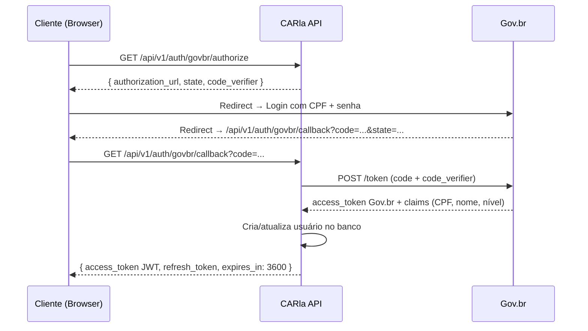

# Autenticação

:::info Para quem é esta página
Engenheiros back-end e front-end. Contexto arquitetural: [ADR-005 — Gov.br](../arquitetura/decisoes/adr-005-govbr.md).
:::

## Fluxo OAuth2 Authorization Code + PKCE



## Estrutura do JWT

```json
{
  "sub": "uuid-do-usuario",
  "nome": "João Silva",
  "tipo_usuario": "produtor_rural",
  "nivel_confiabilidade": "prata",
  "jti": "uuid-unico",
  "iat": 1705312200,
  "exp": 1705315800
}
```

:::caution CPF não está no JWT
O CPF não é incluído no token por segurança. Para obter o CPF, o serviço consulta o banco usando o `sub` (user_id).
:::

## Endpoints de Auth

| Endpoint | Descrição |
|---|---|
| `GET /api/v1/auth/govbr/authorize` | Inicia fluxo — retorna URL do Gov.br |
| `GET /api/v1/auth/govbr/callback` | Callback Gov.br — emite JWT |
| `GET /api/v1/auth/me` | Dados do usuário autenticado |
| `POST /api/v1/auth/refresh` | Renova access token com refresh token |
| `POST /api/v1/auth/logout` | Revoga sessão (blacklist JTI no Redis) |

## Níveis de Confiabilidade Gov.br

| Nível | Verificação | Operações permitidas |
|---|---|---|
| Bronze | E-mail verificado | Consultas, rascunhos |
| Prata | Biometria ou banco | Submissão de processo, correção |
| Ouro | Reconhecimento facial | Operações críticas de admin |

## RBAC — Roles do Sistema

| Role | Descrição |
|---|---|
| `produtor_rural` | Acessa apenas seus próprios processos |
| `consultor_ambiental` | Acessa processos com autorização do proprietário |
| `analista_ambiental` | Vê e analisa todos os processos |
| `supervisor_ambiental` | Tudo do analista + recursos + relatórios |
| `admin` | Acesso total ao sistema |

:::warning Retorno 404, não 403
Para evitar enumeração de recursos, o sistema retorna `404 Not Found` quando o usuário tenta acessar um recurso que existe mas não tem permissão — não `403 Forbidden`.
:::
