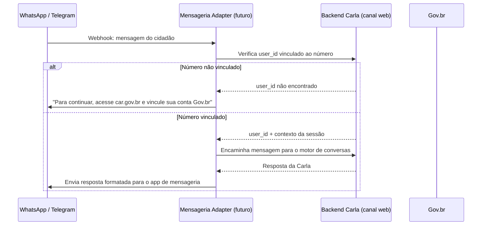

# API — Adapter de Mensageria

:::caution Integração Opcional / Fora do MVP
Esta documentação descreve uma integração prevista para versões posteriores ao MVP. A Carla não depende de WhatsApp, Telegram ou qualquer app de mensageria para funcionar.

O canal core é a **interface web própria**, acessível via `car.gov.br`. Ver [ADR-008: Canal Web Próprio](../arquitetura/decisoes/adr-008-canal-web-proprio.md).
:::

## Conceito do Adapter

A integração com apps de mensageria será implementada como um **serviço adapter desacoplado** — ele recebe webhooks do app de mensageria, identifica o cidadão via `user_id` do Gov.br, e repassa a mensagem para o mesmo backend de conversas do canal web.

O backend de conversas **não muda** — apenas ganha uma nova entrada de canal.



## Endpoints Planejados

| Método | Path | Descrição |
|---|---|---|
| `POST` | `/api/v1/adapter/mensageria/webhook` | Recebe mensagens de apps de mensageria |
| `POST` | `/api/v1/adapter/mensageria/vincular/solicitar` | Gera token para vinculação de número a user_id |
| `GET` | `/api/v1/adapter/mensageria/vincular/callback` | Callback Gov.br para concluir vinculação |
| `DELETE` | `/api/v1/adapter/mensageria/vincular` | Desvincula número (LGPD) |

## Privacidade — Número como Hash

O número de telefone **nunca deve ser armazenado em claro**. Apenas o hash SHA-256 para fins de vinculação:

```python
number_hash = hashlib.sha256(f"+5511999998888{APP_SALT}".encode()).hexdigest()
```

Isso atende ao princípio de **minimização de dados** da LGPD.

## Operações NÃO disponíveis via apps de mensageria

Por serem atos jurídicos formais, estas operações sempre exigem a interface web da Carla:

- Criação de processo CAR (6 etapas completas)
- Upload de documentos formais
- Correção de pendências com reenvio de documentos
- Envio/finalização do cadastro

## Ver também

- [ADR-007: Provider WhatsApp (Superada)](../arquitetura/decisoes/adr-007-whatsapp.md) — decisão anterior, superada
- [ADR-008: Canal Web Próprio](../arquitetura/decisoes/adr-008-canal-web-proprio.md) — decisão vigente
- [UC-013: Integração com Mensageria (Futuro)](../produto/casos-de-uso.md) — caso de uso formal
- [Integração com Mensageria (UX)](../design/fluxos/whatsapp.md) — fluxo de UX do adapter futuro
