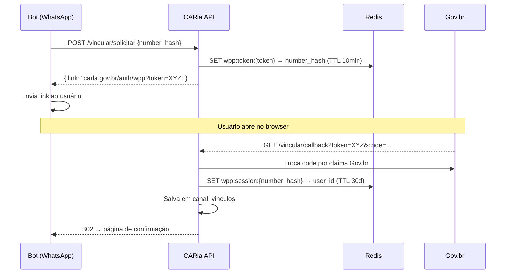

# API — Canal WhatsApp

:::info Para quem é esta página
Engenheiros back-end. Para o fluxo UX, veja [Fluxo WhatsApp](../design/fluxos/whatsapp.md). Para contexto arquitetural, veja [ADR-005](../arquitetura/decisoes/adr-005-govbr.md).
:::

## Fluxo de Vinculação

O WhatsApp não suporta OAuth2. A autenticação usa um link temporário como "ponte":



## Endpoints

| Método | Path | Descrição | Auth |
|---|---|---|---|
| `POST` | `/api/v1/whatsapp/vincular/solicitar` | Gera token de vinculação | API Key interna |
| `GET` | `/api/v1/whatsapp/vincular/callback` | Callback Gov.br — vincula número | Pública (redirect_uri) |
| `POST` | `/api/v1/whatsapp/webhook` | Recebe mensagens da Meta | HMAC-SHA256 |
| `GET` | `/api/v1/whatsapp/webhook` | Challenge de verificação Meta | Pública |
| `POST` | `/api/v1/whatsapp/mensagem` | Envia mensagem ativa | API Key interna |
| `DELETE` | `/api/v1/whatsapp/vincular` | Desvincula número (LGPD) | JWT |

## Webhook Meta — Validação de Assinatura

```python
import hmac, hashlib

def validar_assinatura(body: bytes, signature: str, app_secret: str) -> bool:
    expected = hmac.new(app_secret.encode(), body, hashlib.sha256).hexdigest()
    return hmac.compare_digest(f"sha256={expected}", signature)
```

:::warning Responda em < 20 segundos
A Meta considera o webhook como falha se não receber resposta em 20s. Toda a lógica de negócio deve ser assíncrona (publicar em fila e retornar `{}` imediatamente).
:::

## Privacidade — Número como Hash

O número de telefone **nunca é armazenado em claro**. Apenas o hash SHA-256:

```python
number_hash = hashlib.sha256(f"+5511999998888{APP_SALT}".encode()).hexdigest()
```

Isso atende ao princípio de **minimização de dados** da LGPD.

## Operações NÃO disponíveis pelo WhatsApp

Por serem atos jurídicos formais, estas operações exigem o portal web:

- Submissão de processo
- Upload de documentos
- Correção de pendências
- Aprovação/rejeição pelo analista
