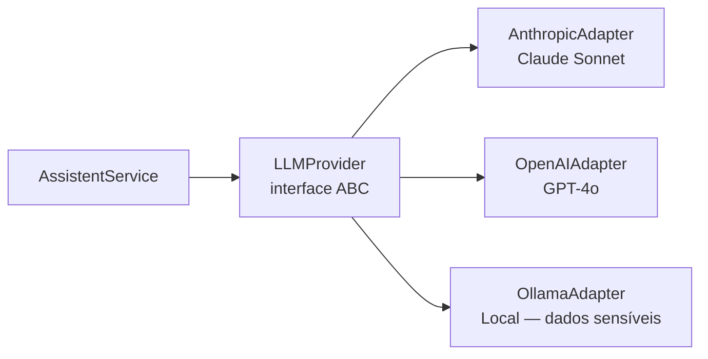

# Estratégia de IA

:::info Para quem é esta página
Engenheiros back-end e ML engineers. Decisão arquitetural: [ADR-006](./decisoes/adr-006-ia.md).
:::

## Arquitetura LLM Agnóstico



**Seleção por configuração:**
```bash
LLM_PRIMARY_PROVIDER=anthropic  # ou openai, ollama
```

A troca de provider **não exige mudança de código** — apenas variável de ambiente.

## PII Masking (conformidade LGPD)

Antes de enviar qualquer texto para um LLM externo na nuvem, o sistema substitui dados pessoais por tokens:

```python
class PIIMasker:
    PATTERNS = [
        (r'\d{3}\.?\d{3}\.?\d{3}-?\d{2}', '[CPF]'),          # CPF
        (r'-?\d{1,3}\.\d{4,8},\s*-?\d{1,3}\.\d{4,8}', '[COORD]'),  # Lat/Lon
    ]

    def mascarar(self, texto: str) -> tuple[str, dict]:
        # Retorna texto mascarado + mapeamento reverso
        ...
```

:::caution Regra de ouro
Dados sensíveis (CPF, coordenadas do imóvel) → **Ollama local** sempre.
Dúvidas genéricas sobre CAR → Claude ou GPT-4o (sem PII).
:::

## RAG — Retrieval-Augmented Generation

O assistente responde com base na **base de conhecimento indexada**, não apenas no treinamento do LLM.

**Fontes indexadas:**
- Lei 12.651/2012 (Código Florestal)
- Instruções Normativas do SICAR
- Manual de Uso do SICAR v3.0
- FAQ CAR — Perguntas Frequentes

**Pipeline:**
```
Query do usuário
   → Embedding (text-embedding-3-small)
   → Busca vetorial no pgvector (top-5 chunks)
   → Monta prompt com chunks como contexto
   → LLM gera resposta embasada
   → Resposta com indicação de fonte
```

**Cache semântico:** Perguntas com ≥ 95% de similaridade retornam resposta em cache (Redis, TTL 1h) — evita chamada desnecessária ao LLM.

## Custos e Limites

| Cenário | Provider | Motivo |
|---|---|---|
| Dúvida sobre CAR (sem PII) | Claude / GPT-4o | Melhor qualidade em PT-BR |
| Dados do processo (com PII) | Ollama local | LGPD |
| Perguntas frequentes | Cache Redis | Custo zero |
| Geração de dossiê | Claude (premium) | Qualidade exige modelo maior |

## STT — Transcrição de Voz (Whisper)

O canal WhatsApp aceita mensagens de áudio, que são transcritas localmente antes de serem processadas pelo assistente IA.

| Parâmetro | Valor |
|---|---|
| **Modelo** | `whisper-small` — melhor balanço latência/qualidade para PT-BR |
| **Runtime** | Container `faster-whisper` (não Ollama — Ollama é runtime de LLM, não de STT) |
| **Idioma** | `language="pt"` forçado — evita erros de detecção automática em sotaques regionais |
| **Formato de entrada** | `.ogg/Opus` (formato padrão do WhatsApp) |
| **Retenção** | Arquivo deletado imediatamente após transcrição — não persistido |

**Requisitos de hardware:**

| Configuração | Latência estimada (áudio 30s) | Adequado para |
|---|---|---|
| 4 vCPU + 4 GB RAM (CPU only) | ~8–12 segundos | MVP / piloto (volume baixo) |
| GPU com 4 GB VRAM (CUDA) | ~2–3 segundos | Produção (volume médio/alto) |

:::caution Não use Ollama para o Whisper
Ollama é um runtime para modelos de linguagem (LLMs). Ele **não suporta** modelos de Speech-to-Text como o Whisper. Usar `ollama pull whisper` vai falhar. O runtime correto é `faster-whisper` (Python) ou `whisper.cpp` (C++), rodando em container separado.
:::

:::tip Fallback para transcrição com baixa confiança
Quando o score de confiança da transcrição for baixo (< 0.6), o bot deve mostrar o texto transcrito ao usuário e pedir confirmação: *"🎙️ Entendi: '[texto]'. É isso mesmo?"* — evita responder algo sem relação com a pergunta real.
:::

## Ver também

- [ADR-006 — Estratégia de IA](./decisoes/adr-006-ia.md)
- [API do Assistente](../apis/assistente.md) — endpoints de chat e SSE
- [Banco de Dados — pgvector](./banco-de-dados.md#busca-semântica-pgvector)
