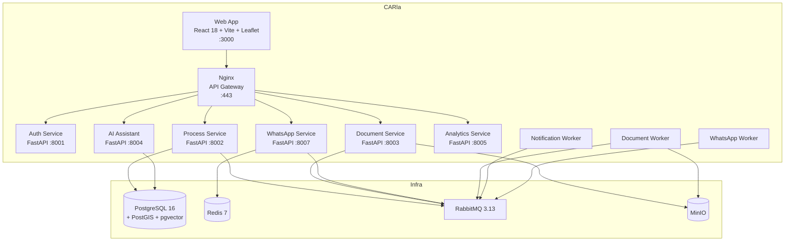

# Arquitetura — Visão Geral

:::info Para quem é esta página
Engenheiros e arquitetos. Para decisões técnicas justificadas, veja os [ADRs](./decisoes/index.md).
:::

## C4 — Nível 1: Contexto do Sistema

```mermaid
graph TB
    PR[Produtor Rural] -->|HTTPS| CL[CARla]
    AN[Analista Ambiental] -->|HTTPS| CL
    WP[WhatsApp] -->|Webhook| CL
    CL -->|OAuth2 OIDC| GB[Gov.br]
    CL -->|Integração direta\n(modelo apps estaduais)| SI[SICAR]
    CL -->|REST| IB[IBAMA / DETER]
    CL -->|REST| SG[SIGEF / INCRA]
    CL -->|REST| MB[MapBiomas]
    CL -->|LLM API| LM[Claude / GPT-4o / Ollama]
```

---

## C4 — Nível 2: Containers



---

## Arquitetura Lógica

### Camadas (Clean Architecture)

```
┌─────────────────────────────────────────┐
│  Presentation  — FastAPI Routes + Pydantic │
├─────────────────────────────────────────┤
│  Application   — Use Cases + Orchestration │
├─────────────────────────────────────────┤
│  Domain        — Entities, VOs, Events     │  ← sem dependências externas
├─────────────────────────────────────────┤
│  Infrastructure — SQLAlchemy, RabbitMQ    │
└─────────────────────────────────────────┘
```

### CQRS

| Tipo | Caminho | Exemplo |
|---|---|---|
| **Command** | Controller → UseCase → Domain → Repository | `SubmeterProcesso` |
| **Query** | Controller → QueryService → SQL direto | `ListarProcessosDashboard` |

:::tip Por que CQRS aqui?
Queries de dashboard (com joins e agregações) são muito mais simples e performáticas como SQL direto do que carregando agregados completos do domínio. O domínio só entra no caminho de escrita.
:::

### Outbox Pattern

Para garantir que eventos de domínio não se percam mesmo em falha do broker:

```
1. Processo salvo no banco   ┐
2. Evento salvo em `outbox`  ┘  mesma transação ACID
3. Outbox Relay Worker publica no RabbitMQ assincronamente
4. Evento marcado como `publicado`
```

---

## Observabilidade

| Ferramenta | Função |
|---|---|
| **OpenTelemetry** | Traces distribuídos entre serviços |
| **Prometheus** | Métricas customizadas (15 métricas de negócio) |
| **Grafana** | Dashboards operacional, de negócio e de infra |

**Métricas-chave:**
- `car_processos_submetidos_total` — volume de negócio
- `car_tempo_analise_horas` (histogram) — eficiência operacional
- `car_llm_latencia_segundos` (histogram, por provider) — custo/qualidade de IA
- `car_fila_tamanho` (gauge, por fila) — saúde da mensageria

## Ver também

- [Serviços em detalhe](./servicos.md) — responsabilidades de cada container
- [Banco de Dados](./banco-de-dados.md) — schema e extensões PostgreSQL
- [Mensageria](./mensageria.md) — RabbitMQ, exchanges, retry e DLQ
