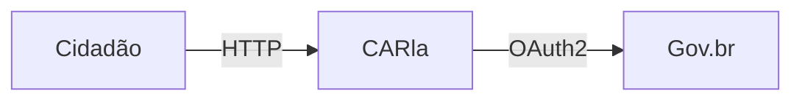

# Como Escrever Documentação

:::info Para quem é esta página
Qualquer pessoa que quer contribuir com a documentação do CARla — seja engenheiro, PM ou designer.
:::

## Estrutura de cada página

Todo arquivo `.md` deve começar com frontmatter:

```markdown
---
sidebar_position: 3        # posição no menu
title: "Título da Página"  # título no sidebar e na aba
description: "Uma frase descrevendo o conteúdo."  # SEO + preview
tags: [produto, ux, api]   # audiência e categorias
---
```

## Admonitions — Caixas de Destaque

Use admonitions para guiar o leitor e não enterrar informações importantes em parágrafos:

```markdown
:::info Para quem é esta página
Engenheiros back-end. Para o contexto de produto, veja [Visão](../produto/visao.md).
:::

:::tip Boa prática
Use cursors em vez de offset para paginação — é mais estável e performático.
:::

:::warning Armadilha comum
Nunca retorne 403 quando o recurso não pertence ao usuário — use 404.
:::

:::caution Requisito legal
CPF nunca deve aparecer em logs. Use o hash SHA-256 para rastreabilidade.
:::

:::note Contexto adicional
Esta decisão foi tomada na época do hackathon e pode ser revisada na Fase 3.
:::
```

## Links Cruzados

Sempre use **links relativos** entre documentos:

```markdown
<!-- ✅ Correto — funciona offline e em qualquer baseUrl -->
[Personas](../produto/personas.md)
[ADR-003](../arquitetura/decisoes/adr-003-eda.md)

<!-- ❌ Evitar — quebra se baseUrl mudar -->
[Personas](/docs/produto/personas)
```

## Diagramas com Mermaid

Para fluxos de usuário, sequências e relações entre componentes:

````markdown

````

Tipos mais usados: `flowchart`, `sequenceDiagram`, `stateDiagram-v2`, `journey`.

## Código com Syntax Highlight

Use o nome da linguagem após as três crases:

````markdown
```python
def calcular_area(total: float, bioma: str) -> float:
    return total * PERCENTUAIS[bioma]
```

```sql
SELECT * FROM processos_car WHERE status = 'submetido';
```

```bash
make dev && make test
```
````

Linguagens disponíveis: `python`, `sql`, `bash`, `typescript`, `yaml`, `json`.

## Padrão de Cabeçalho de Audiência

**Todo arquivo** deve ter um `:::info Para quem é esta página` logo após o título:

```markdown
# Título da Página

:::info Para quem é esta página
Designers e front-end engineers. Para contexto de negócio, veja [Visão do Produto](../produto/visao.md).
:::
```

Isso ajuda o leitor a saber se está no lugar certo e onde ir se precisar de contexto diferente.

## Checklist antes de commitar documentação

- [ ] Frontmatter completo (sidebar_position, title, description, tags)
- [ ] `:::info Para quem é esta página` presente
- [ ] Links cruzados com caminhos relativos
- [ ] Nenhum link quebrado (`npm run build` não retorna warnings)
- [ ] Código com syntax highlight correto
- [ ] Tabelas formatadas corretamente
