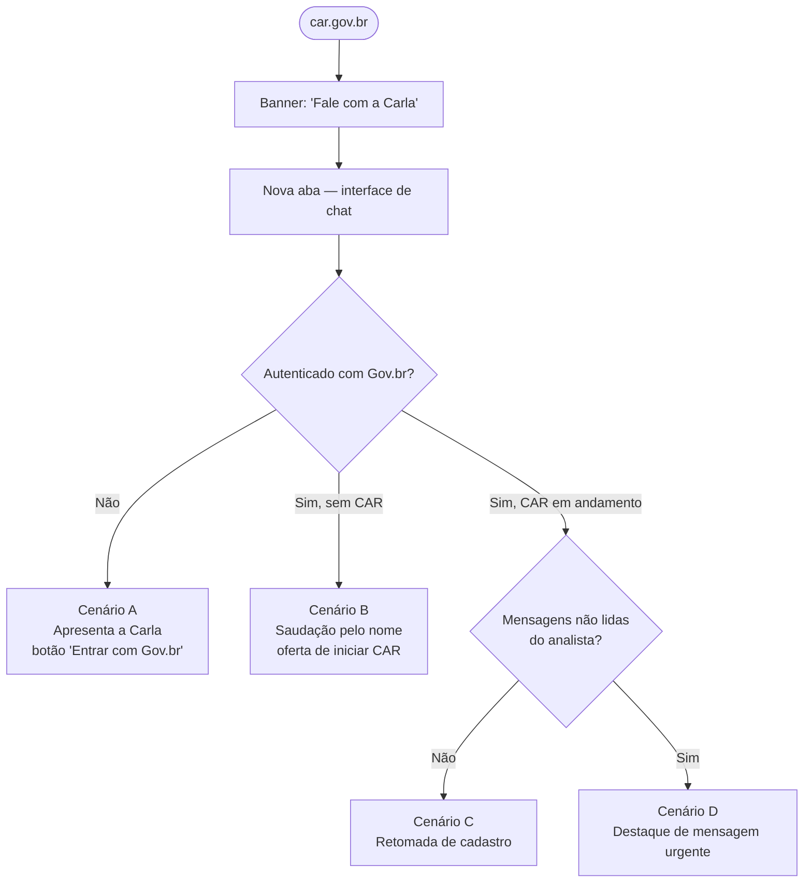
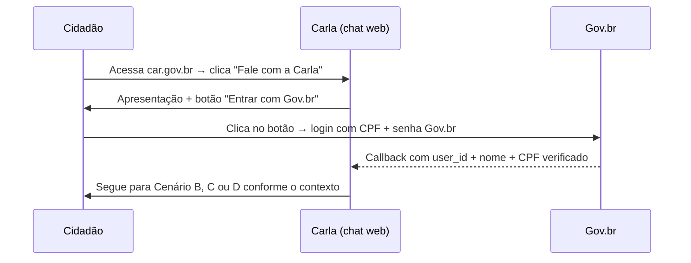

# Abertura da Carla

:::info Para quem é esta página
Designers e front-end engineers. Para os casos de uso formais, veja [UC-010 a UC-012](../../produto/casos-de-uso.md). Para os scripts completos de conversa, veja [Sequência de Mensagens](./mensagens-simuladas.md).
:::

## Ponto de Entrada

O cidadão chega à Carla por um banner ou botão em `car.gov.br`. A interface de chat abre em uma nova aba. Não há instalação de app, não há cadastro separado — a identidade é o Gov.br.



---

## Os 4 Cenários de Abertura

### Cenário A — Primeiro acesso (sem login)

O cidadão não está autenticado. A Carla se apresenta e solicita o login via Gov.br antes de qualquer outra ação.

```
Carla: Olá! Eu sou a Carla, assistente virtual do Cadastro Ambiental Rural (CAR).

       Posso te ajudar a:
       🌱 Criar seu CAR do zero
       💬 Tirar dúvidas sobre o CAR e seu processo
       📬 Acompanhar mensagens e pendências do seu analista ambiental

       Para começar, preciso confirmar sua identidade pelo Gov.br.
       Pode clicar no botão abaixo para entrar com segurança.

       [ 🔑 Entrar com Gov.br ]
```



---

### Cenário B — Logado, sem nenhum CAR iniciado

```
Carla: Olá, {nome}! Que bom te ver por aqui. 😊

       Vi que você ainda não iniciou nenhum cadastro de imóvel rural.
       Quer começar agora?
       Eu te guio passo a passo, é mais simples do que parece.

       [ 🌱 Iniciar meu CAR ] [ ❓ Tenho dúvidas antes ]
```

**Lógica de decisão:**
- A Carla consulta o histórico vinculado ao `user_id` do Gov.br
- Se não há nenhum processo em nenhum estado, exibe Cenário B
- Ao clicar "Iniciar meu CAR", a Carla já pré-preenche os dados da Etapa 1 (Cadastrante) com as informações do Gov.br — nome e CPF verificados

---

### Cenário C — Logado, com CAR em andamento, sem pendências novas

```
Carla: Olá de novo, {nome}! 🌿

       Seu cadastro do imóvel "{nome_propriedade}" está na etapa {etapa_atual}.
       Quer continuar de onde parou?

       [ ▶️ Continuar cadastro ] [ 📊 Ver status completo ]
```

**Lógica de decisão:**
- Há pelo menos um processo com status `Em Andamento` ou `Cadastrado`
- Nenhuma mensagem não lida do analista com retorno pendente
- A Carla exibe o último processo ativo (se houver mais de um, lista todos)

---

### Cenário D — Logado, com mensagens não lidas do analista

```
Carla: Olá, {nome}! Tenho uma novidade importante. 📬

       Você tem {qtd} mensagem(ns) do analista ambiental sobre o seu CAR
       "{nome_propriedade}", e pelo menos uma precisa de retorno seu.
       Quer ver agora?

       [ 📬 Ver mensagens ] [ 📊 Ver status do CAR ]
```

**Lógica de decisão:**
- Há mensagens do analista marcadas como "retorno necessário" que o cidadão ainda não leu
- Este cenário tem prioridade sobre o Cenário C — mensagens do analista vêm primeiro
- Ao clicar "Ver mensagens", a Carla exibe o conteúdo da mensagem e os botões de ação (responder, saber mais sobre PRA, etc.)

---

## Estados da Sessão

| Estado | O que a Carla faz |
|---|---|
| Não autenticado | Cenário A — apresentação + botão Gov.br |
| Autenticado, sem processos | Cenário B — oferta de iniciar CAR |
| Autenticado, processo em andamento, sem novidades | Cenário C — retomada |
| Autenticado, mensagem do analista com retorno pendente | Cenário D — destaque urgente |
| Autenticado, processo com status Regular | Exibe Recibo de Inscrição disponível |
| Sessão Gov.br expirada | Solicita novo login ao primeiro acesso |

---

## Persistência e Retomada

A sessão da Carla é vinculada ao `user_id` do Gov.br e persiste entre visitas. O cidadão pode:

- Sair e voltar em qualquer momento — o progresso de cada etapa é salvo automaticamente
- Retomar exatamente da etapa onde parou, com dados já preenchidos
- Ver o histórico de todas as conversas anteriores (leitura)

:::tip Salvo automaticamente
Ao fechar a aba ou desligar o dispositivo, nenhum dado preenchido é perdido. A Carla salva o progresso ao avançar cada campo durante a conversa.
:::

---

## Pontos de Atenção para Design

:::warning Cenário D tem prioridade visual
Quando o cidadão tem mensagens não lidas do analista com retorno pendente, isso deve ser visualmente destacado. A Carla não deve suprimir essa informação exibindo o Cenário C primeiro — a sequência de prioridade é: D > C > B.
:::

:::tip Botão Gov.br — acessibilidade
O botão "Entrar com Gov.br" deve ser grande, centralizado e com bom contraste. Cidadãos rurais frequentemente acessam por celulares com tela pequena e conexão instável. O fluxo OAuth2 deve lidar graciosamente com timeouts e retentativas.
:::

:::note Canal web — não substituto do fluxo tradicional
O fluxo de abertura deve deixar claro, na apresentação do Cenário A, que a Carla é uma opção — não obriga o cidadão a abandonar o SICAR ou as plataformas estaduais. O CAR feito pela Carla tem o mesmo valor que o feito diretamente no SICAR.
:::

---

## Ver também

- [Sequência de Mensagens](./mensagens-simuladas.md) — scripts completos de todos os fluxos da Carla
- [Fluxo do Cidadão](./cidadao.md) — jornada das 6 etapas de criação do CAR
- [ADR-005: Gov.br](../../arquitetura/decisoes/adr-005-govbr.md) — decisão de autenticação
- [ADR-008: Canal Web Próprio](../../arquitetura/decisoes/adr-008-canal-web-proprio.md) — decisão de canal
- [UC-010 a UC-012](../../produto/casos-de-uso.md) — casos de uso formais de abertura e retomada
