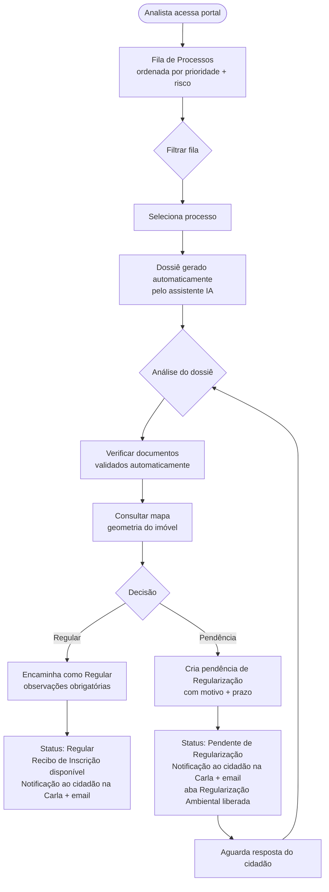

# Fluxo do Analista

:::info Para quem é esta página
Designers e front-end engineers. Para os casos de uso formais, veja [UC-005 a UC-008](../../produto/casos-de-uso.md).
:::

## Estrutura do Painel do Analista

O painel tem **5 KPIs globais** sempre visíveis e **3 abas** de navegação:

### KPIs globais (topo)

| KPI | Semântica |
|---|---|
| **Total de CARs** | Todos os processos ativos no sistema |
| **Aguardam você** | Conversas com `aguardaResposta = analista` — prioridade máxima |
| **Conversas paradas** | Sem atualização há 7+ dias (de qualquer parte) |
| **Com passivo ambiental** | Processos com flag PRA ativo (déficit ambiental identificado) |
| **Regularizados** | Processos com status `Regular` confirmado |

### Aba 1 — Conversas

Lista filtrável de todos os processos, com busca por proprietário, ID ou município. Ordenação padrão: conversas que aguardam o analista primeiro, depois por tempo parado (decrescente).

**Filtros disponíveis:** status SICAR · aguarda (analista / proprietário / sem pendência) · parado (> 7d / > 15d / > 30d)

**Colunas da tabela:**

| Coluna | Detalhe |
|---|---|
| Nº Processo | Formato `UF-YYYY-NNNNN`; ⚠️ indica passivo ambiental (flag PRA) |
| Proprietário | Nome + tipo de documento de domínio |
| Município | — |
| Área (ha) | — |
| Etapa atual | Cadastrante / Imóvel / Domínio / Documentação / Geo / Informações / Regularização |
| Status | Badge colorido com status oficial SICAR |
| Última atividade | Dias desde a última mensagem; amarelo ≥ 7d, vermelho ≥ 15d |
| Pendência | `⚡ Aguarda analista` ou `⏳ Aguarda proprietário · Nd` |

**Banner de atenção:** quando há conversas `aguarda analista`, um painel azul as destaca no topo da aba com nome, município, área e etapa atual — evita que se percam na lista.

**Tipos de documento de domínio reconhecidos:** Escritura · Contrato de Compra e Venda · Certidão de Registro · Autorização de Ocupação · Imissão de Posse · Termo de Autodeclaração

### Aba 2 — Painel Administrativo

KPIs de eficiência operacional do piloto (dados reais, Acre Jan–Jun 2026):

| KPI | Valor |
|---|---|
| Atendimentos realizados | 1.284 (desde o lançamento) |
| Tempo médio por CAR | 28 min (−41% vs. fluxo tradicional; tendência de queda) |
| Horas de servidor poupadas | 312 h (≈ 39 dias de trabalho) |
| Imóveis cadastrados via Carla | 847 de 1.284 iniciados |

Inclui gráfico de avaliação de qualidade (4,5/5 média; 280 avaliações; 82% satisfeitos) e gráfico de tendência do tempo médio por mês (48 → 28 min).

### Aba 3 — Visão Geral

- **Distribuição por status** (donut): quantidade de processos em cada status SICAR
- **Evolução mensal**: linha novos / concluídos / pendentes (Jan–Jun)
- **CARs por município**: barra horizontal por município do piloto

---

## Fluxo de Análise e Decisão

---

:::warning Recibo de Inscrição do Imóvel Rural no CAR
Ao encaminhar um cadastro como Regular, o sistema disponibiliza o **Recibo de Inscrição do Imóvel Rural no CAR** — comprovante oficial gerado pelo SICAR. Este é o documento com validade jurídica para transações rurais (crédito, comercialização). O comprovante interno do CARla complementa, mas não substitui o Recibo de Inscrição.
:::

:::caution Decisão — responsabilidade do servidor
O dossiê gerado por IA é **apoio à decisão**, não substituto. Atos administrativos precisam ter **motivação própria do servidor** para ter validade jurídica. O campo de observações deve ser preenchido pelo analista — mesmo que brevemente. A IA resume; o analista decide e fundamenta.
:::

---

## O que o Analista vê na Fila

Cada processo na fila exibe:

| Campo | O que significa |
|---|---|
| **Status SICAR** | `Em Andamento`, `Em Análise`, `Pendente de Regularização`, `Regular` |
| **Score de completude** | 0–100% — quanto dos dados está preenchido e validado |
| **Score de risco** | 0–10 — baseado em alertas IBAMA/DETER |
| **Tempo na fila** | Quanto tempo desde o envio |
| **Município / Estado** | Para filtros regionais |
| **Tipo do imóvel** | Minifúndio, pequena, média, grande |

:::tip Ordenação padrão
A fila é ordenada por: (1) prioridade urgente primeiro, (2) maior score de risco, (3) mais tempo na fila. O analista pode reordenar por qualquer coluna.
:::

:::note Score de risco e isonomia
Qualquer critério de priorização algorítmica em serviço público precisa de **fundamentação legal explícita** (portaria, instrução normativa do órgão) para não ser questionado por CGU/TCU ou em ação judicial por isonomia. O score de risco é ferramenta de apoio ao analista — não deve ser o único critério de ordenação sem respaldo normativo.
:::

---

## O Dossiê Automático

Ao assumir um processo, a Carla gera um dossiê em PDF com:

1. **Resumo executivo** — gerado por IA em linguagem técnica
2. **Dados do requerente** — nome, CPF (mascarado), contato
3. **Dados do imóvel** — área, município, bioma, tipo
4. **Análise documental** — status de cada documento com campos extraídos
5. **Mapa** — geometria do imóvel com camadas de APP e Reserva Legal
6. **Alertas externos** — IBAMA, DETER (quando disponível)
7. **Pendências anteriores** — histórico de interações

:::note Tempo de geração
O dossiê leva até 30 segundos para ser gerado. O analista pode começar a revisar os dados enquanto ele é montado.
:::

---

## Criar Pendência de Regularização — Padrões de UX

Para criar pendência de forma eficiente:

- **Templates pré-definidos** por tipo de problema (documentação faltante, geometria inválida, área divergente)
- **Campo de descrição livre** para detalhar além do template
- **Sugestão de prazo** baseada no tipo de pendência (padrão: 15 dias)
- **Preview** da mensagem que o cidadão vai receber na Carla antes de confirmar

Ao confirmar a pendência:
- Status muda para `Pendente de Regularização`
- Cidadão recebe notificação na Carla (Cenário D — destaque imediato) + email
- Aba **Regularização Ambiental** é liberada no Demonstrativo da Situação do CAR

:::warning Clareza na mensagem ao cidadão
O texto da pendência vai direto para o chat da Carla do cidadão. Evite termos técnicos e linguagem de servidor. Use o [guia de linguagem](../principios.md#linguagem-e-tom). O cidadão precisa entender exatamente o que fazer.
:::

---

## Comunicação com o Cidadão

O analista pode enviar mensagens diretamente pelo processo — o cidadão as recebe na Carla como mensagens do analista. Quando há mensagens não lidas com retorno necessário, a Carla prioriza e exibe o Cenário D na próxima abertura do cidadão.

---

## Ver também

- [Fluxo do Cidadão](./cidadao.md) — o que acontece do lado de quem submete
- [Sequência de Mensagens](./mensagens-simuladas.md) — mensagens de notificação de pendência que o cidadão recebe
- [API do Analista](../../apis/analista.md) — endpoints de encaminhamento e pendência
- [Segurança & RBAC](../../seguranca/autenticacao.md) — permissões do analista
