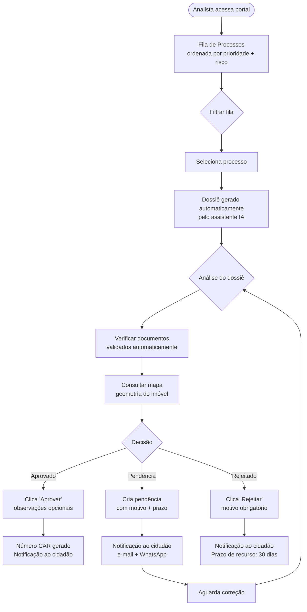

# Fluxo do Analista

:::info Para quem é esta página
Designers e front-end engineers. Para os casos de uso formais, veja [UC-005 a UC-008](../../produto/casos-de-uso.md).
:::

## Fluxo de Análise e Decisão

---

## O que o Analista vê na Fila

Cada processo na fila exibe:

| Campo | O que significa |
|---|---|
| **Status** | `submetido`, `em_analise`, `pendente` |
| **Score de completude** | 0–100% — quanto dos dados está preenchido |
| **Score de risco** | 0–10 — baseado em alertas IBAMA/DETER |
| **Tempo na fila** | Quanto tempo desde a submissão |
| **Município / Estado** | Para filtros regionais |
| **Tipo do imóvel** | Minifúndio, pequena, média, grande |

:::tip Ordenação padrão
A fila é ordenada por: (1) prioridade urgente primeiro, (2) maior score de risco, (3) mais tempo na fila. O analista pode reordenar por qualquer coluna.
:::

---

## O Dossiê Automático

Ao assumir um processo, o CARla gera um dossiê em PDF com:

1. **Resumo executivo** — gerado por IA em linguagem técnica
2. **Dados do requerente** — nome, CPF (mascarado), contato
3. **Dados do imóvel** — área, município, bioma, tipo
4. **Análise documental** — status de cada documento com campos extraídos
5. **Mapa** — geometria do imóvel com camadas de APP e Reserva Legal
6. **Alertas externos** — IBAMA, DETER (quando disponível)
7. **Pendências anteriores** — histórico de interações

:::note Tempo de geração
O dossiê leva até 30 segundos para ser gerado. O analista pode começar a revisar os dados enquanto ele é montado.
:::

---

## Criar Pendência — Padrões de UX

Para criar pendência de forma eficiente:

- **Templates pré-definidos** por tipo de problema (documentação faltante, geometria inválida, área divergente)
- **Campo de descrição livre** para detalhar além do template
- **Sugestão de prazo** baseada no tipo de pendência (padrão: 15 dias)
- **Preview** da mensagem que o cidadão vai receber antes de confirmar

:::warning Clareza na mensagem ao cidadão
O texto da pendência vai direto para o cidadão. Evite termos técnicos e linguagem de servidor. Use o [guia de linguagem](../principios.md#linguagem-e-tom).
:::

## Ver também

- [Fluxo do Cidadão](./cidadao.md) — o que acontece do lado de quem submete
- [API do Analista](../../apis/analista.md) — endpoints de aprovação e pendência
- [Segurança & RBAC](../../seguranca/autenticacao.md) — permissões do analista
