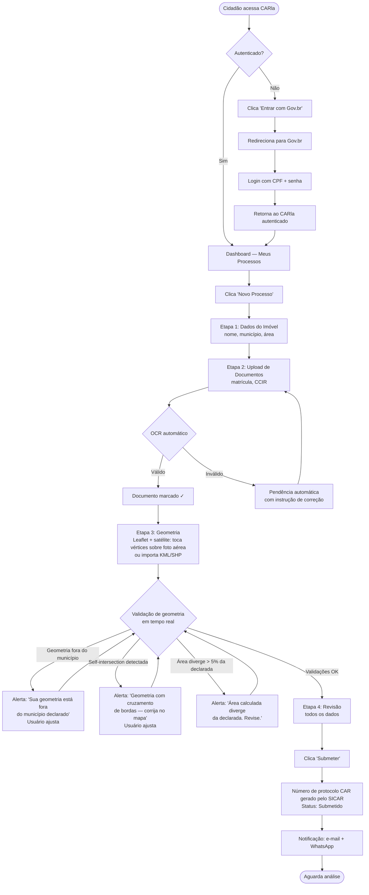
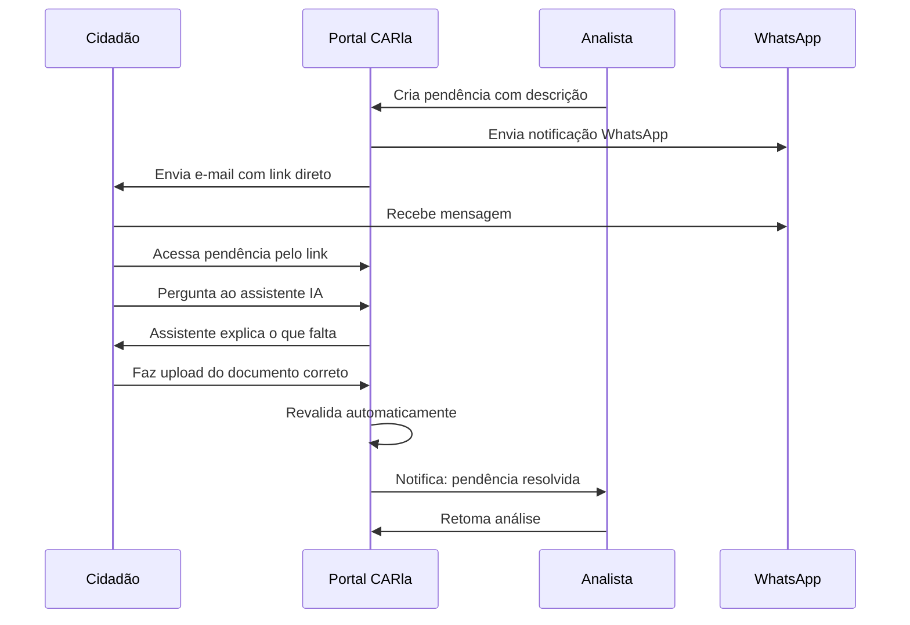

# Fluxo do Cidadão

:::info Para quem é esta página
Designers e front-end engineers. Para os casos de uso formais, veja [UC-001 a UC-009](../../produto/casos-de-uso.md).
:::

## Fluxo Feliz — Registro CAR Completo

---

## Fluxo de Pendência e Correção

---

## Estados do Processo

| Status | O que o cidadão vê | Próxima ação |
|---|---|---|
| `rascunho` | "Em preenchimento" | Continuar preenchendo |
| `submetido` | "Enviado — aguardando analista" | Aguardar |
| `em_analise` | "Em análise" | Aguardar |
| `pendente` | ⚠️ "Pendência — ação necessária" | Responder pendência |
| `aprovado` | ✅ "Aprovado! Baixe seu Certificado CAR" | Baixar Certificado CAR oficial |
| `aprovado_com_pra` | ✅⚠️ "CAR aprovado — mas sua propriedade precisa de regularização ambiental. Veja os próximos passos." | Acessar orientações sobre o PRA |
| `rejeitado` | ❌ "Rejeitado — veja o motivo" | Opção de recurso |

---

## Pontos de Atenção para Design

:::note Por que satélite, não GPS?
GPS de smartphone tem precisão de 10–30m, o que representa erro inaceitável em propriedades pequenas (1–5 ha). O produtor traça os vértices sobre a imagem aérea da sua própria terra — cercas, estradas e cursos d'água visíveis na foto servem de referência precisa. Leaflet com tile layer de satélite (ex: Esri World Imagery) funciona em mobile via touch nativo.
:::

:::warning Geometria é o maior gargalo real do CAR
A geometria incorreta é a principal causa de retrabalho e rejeição no CAR brasileiro. Validações em tempo real (município, área, self-intersection) reduzem erros antes da submissão. Sobreposição com outras propriedades, TIs e UCs é verificada **assincronamente** — não bloqueia a submissão mas gera alerta para o analista e notificação ao cidadão se confirmada.
:::

:::warning Upload em conexão ruim
João pode ter 3G instável. O upload deve:
- Mostrar progresso incremental
- Suportar retomada em caso de falha
- Limitar tamanho a 50MB com mensagem clara antes do envio
:::

:::tip Stepper sempre visível
Em mobile, o stepper deve permanecer fixo no topo durante o preenchimento — o cidadão precisa saber em qual das 4 etapas está a qualquer momento.
:::

## Ver também

- [Fluxo do Analista](./analista.md) — o que acontece depois da submissão
- [Fluxo WhatsApp](./whatsapp.md) — jornada pelo canal WhatsApp
- [Princípios UX](../principios.md) — diretrizes de linguagem e acessibilidade
