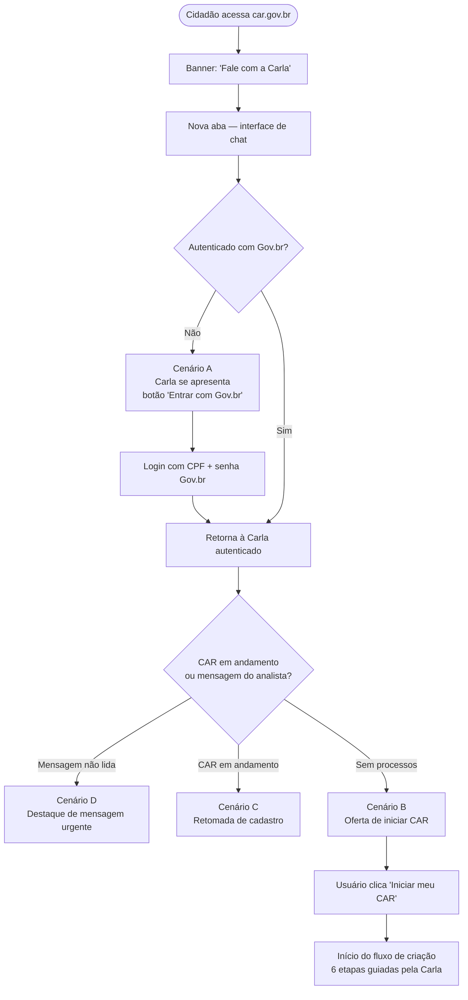
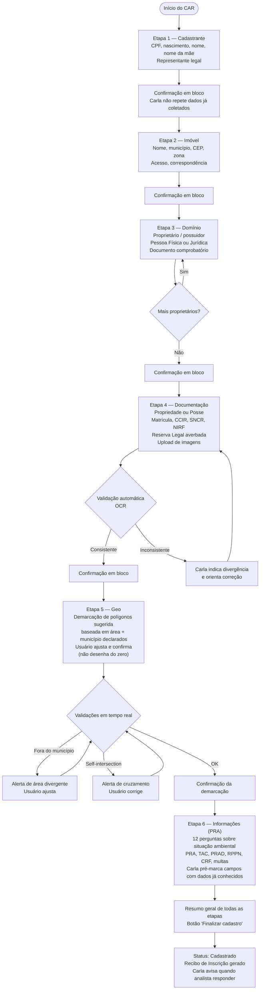
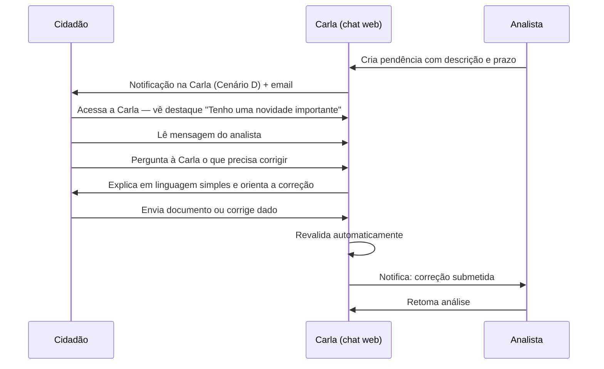

# Fluxo do Cidadão

:::info Para quem é esta página
Designers e front-end engineers. Para os casos de uso formais, veja [UC-001 a UC-012](../../produto/casos-de-uso.md). Para os scripts de conversa, veja [Sequência de Mensagens](./mensagens-simuladas.md).
:::

## Fluxo de Abertura e Identificação

---

## Fluxo de Criação do CAR — 6 Etapas

---

## Fluxo de Pendência e Correção

---

## Status do CAR — Terminologia Oficial do SICAR

| Status SICAR | O que o cidadão vê na Carla | Próxima ação |
|---|---|---|
| `Em Andamento` | "Cadastro em andamento — etapa \{etapa_atual\}" | Continuar preenchendo |
| `Cadastrado` | "Cadastro preenchido — pronto para envio" | Confirmar envio |
| `Gravado/Enviado` | "Cadastro enviado ao SICAR" | Aguardar processamento |
| `Em Análise` | "Em análise pelo analista ambiental" | Aguardar |
| `Pendente de Regularização` | ⚠️ "Pendência — você tem uma mensagem do analista" | Responder à mensagem |
| `Regular` | ✅ "CAR Regular! Recibo de Inscrição disponível" | Baixar Recibo de Inscrição |

:::note Demonstrativo da Situação do CAR
Quando o status é `Pendente de Regularização`, a aba **Regularização Ambiental** é liberada no Demonstrativo da Situação do CAR, onde o cidadão pode aderir ao PRA e acompanhar o Termo de Compromisso.
:::

---

## Pontos de Atenção para Design

:::note Por que demarcação sugerida, não desenho do zero?
A geometria incorreta é a principal causa de retrabalho no CAR. Pedir que o cidadão desenhe o polígono sem referência é uma barreira especialmente para pequenos produtores. A Carla pré-carrega uma sugestão com base nos dados já informados (área declarada + município), que o usuário ajusta — como confirmar a localização de uma encomenda, não como fazer um mapa do zero.
:::

:::warning Geometria — validações em tempo real
Validar enquanto o usuário ancora os vértices (não só ao finalizar) reduz o retrabalho:
- Área calculada diverge da declarada (> 5%): alerta imediato
- Polígono sai do município: alerta imediato
- Self-intersection (bordas que se cruzam): alerta imediato
- Sobreposição com TIs/UCs/outras propriedades: verificação assíncrona — não bloqueia, mas gera alerta para o analista
:::

:::warning Upload em conexão ruim
A etapa 4 (Documentação) envolve envio de imagens. Em conexões 3G instáveis o upload deve:
- Mostrar progresso incremental
- Suportar retomada em caso de falha de rede
- Limitar tamanho a 50MB com mensagem clara antes do envio
:::

:::tip Stepper de etapas sempre visível
Em mobile, o indicador de etapa atual (1 de 6, 2 de 6...) deve permanecer fixo no topo da conversa. O cidadão precisa saber onde está na jornada a qualquer momento.
:::

:::tip Confirmação em bloco — não campo a campo
Ao final de cada etapa, a Carla exibe um resumo de todos os dados daquela etapa para o cidadão revisar de uma só vez. Isso é mais eficiente e menos cansativo do que confirmar cada campo individualmente.
:::

---

## Ver também

- [Sequência de Mensagens](./mensagens-simuladas.md) — scripts completos de conversa
- [Abertura da Carla](./abertura-carla.md) — os 4 cenários de entrada pelo car.gov.br
- [Fluxo do Analista](./analista.md) — o que acontece depois do envio
- [Princípios UX](../principios.md) — diretrizes de linguagem e acessibilidade
