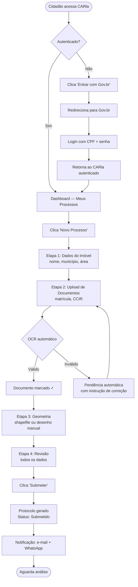
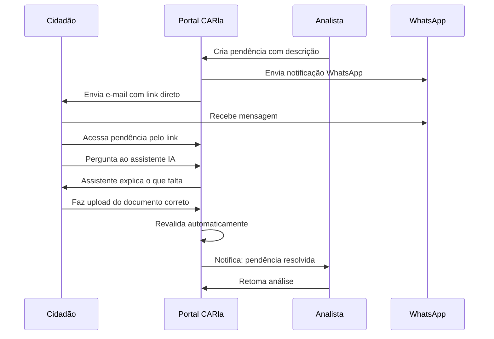

# Fluxo do Cidadão

:::info Para quem é esta página
Designers e front-end engineers. Para os casos de uso formais, veja [UC-001 a UC-009](../../produto/casos-de-uso.md).
:::

## Fluxo Feliz — Registro CAR Completo

---

## Fluxo de Pendência e Correção

---

## Estados do Processo

| Status | O que o cidadão vê | Próxima ação |
|---|---|---|
| `rascunho` | "Em preenchimento" | Continuar preenchendo |
| `submetido` | "Enviado — aguardando analista" | Aguardar |
| `em_analise` | "Em análise" | Aguardar |
| `pendente` | ⚠️ "Pendência — ação necessária" | Responder pendência |
| `aprovado` | ✅ "Aprovado! Baixe seu comprovante" | Baixar certificado CAR |
| `rejeitado` | ❌ "Rejeitado — veja o motivo" | Opção de recurso |

---

## Pontos de Atenção para Design

:::warning Upload em conexão ruim
João pode ter 3G instável. O upload deve:
- Mostrar progresso incremental
- Suportar retomada em caso de falha
- Limitar tamanho a 50MB com mensagem clara antes do envio
:::

:::tip Stepper sempre visível
Em mobile, o stepper deve permanecer fixo no topo durante o preenchimento — o cidadão precisa saber em qual das 4 etapas está a qualquer momento.
:::

## Ver também

- [Fluxo do Analista](./analista.md) — o que acontece depois da submissão
- [Fluxo WhatsApp](./whatsapp.md) — jornada pelo canal WhatsApp
- [Princípios UX](../principios.md) — diretrizes de linguagem e acessibilidade
