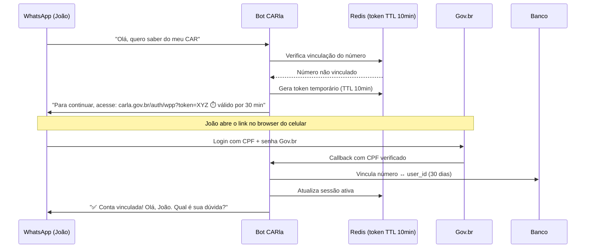
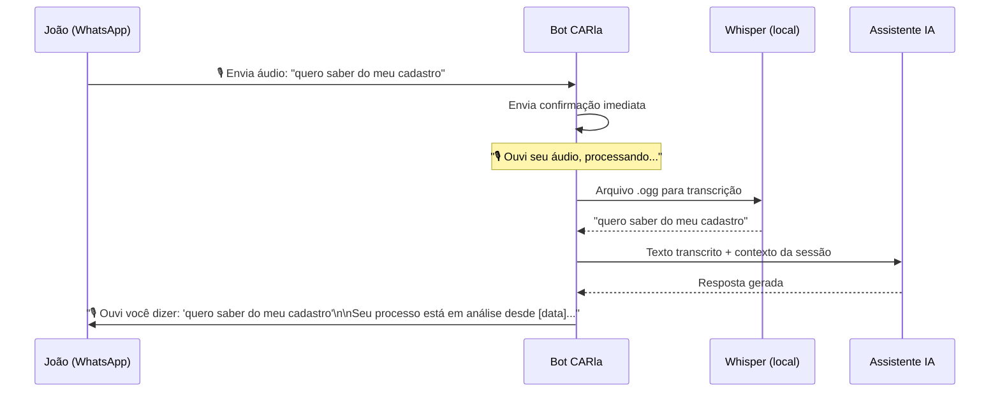

# Fluxo WhatsApp

:::info Para quem é esta página
Designers e front-end engineers. Para implementação técnica, veja [API WhatsApp](../../apis/whatsapp.md).
:::

## O Desafio de Autenticar no WhatsApp

O WhatsApp não suporta redirecionamento OAuth2. Mas o cidadão rural já usa o WhatsApp todo dia — pedir que ele acesse um portal novo é uma barreira.

**Solução adotada:** Fluxo híbrido com link temporário.



---

## Estados da Conversa WhatsApp

| Estado | O que o bot faz |
|---|---|
| Número **não vinculado** | Envia link de vinculação Gov.br (TTL 30min) |
| Link **expirado** | Informa e envia novo link automaticamente |
| Número **vinculado** | Atende normalmente com contexto do usuário |
| Sessão **expirada** (30 dias) | Pede nova vinculação ao primeiro contato |
| Operação **crítica solicitada** | Informa que precisa ser feita no portal + envia link direto |

---

## Mensagens de Exemplo

### Primeiro contato
```
Bot: Olá! Para continuar, preciso confirmar quem você é.
     Acesse este link e faça login com sua conta Gov.br:
     👉 carla.gov.br/auth/wpp?token=ABC123
     ⏳ O link é válido por 30 minutos.
```

### Após vinculação
```
Bot: ✅ Prontinho, João! Sua conta está vinculada.
     Posso te ajudar com:
     📋 Status do seu processo CAR
     ❓ Dúvidas sobre o Cadastro Ambiental Rural
     🔔 Suas notificações pendentes
     O que você quer saber?
```

### Operação crítica
```
Bot: Para enviar documentos ou submeter seu processo,
     você precisa acessar o portal completo.
     Acesse agora: 👉 carla.gov.br/processos/SEU-ID
     (já está logado — não precisa de senha!)
```

---

## Mensagens de Voz

O cidadão rural frequentemente prefere enviar áudio a digitar. O CARla aceita mensagens de voz e as transcreve automaticamente antes de responder.



:::tip Whisper local — sem envio de voz à nuvem
A transcrição usa **Whisper rodando on-premises** — o arquivo de áudio nunca sai da infraestrutura do sistema. Isso resolve a questão LGPD de dados biométricos de voz e evita custo adicional de API de STT.
:::

:::warning Latência esperada
Transcrição + resposta do LLM: **5–8 segundos**. O bot envia uma mensagem de confirmação imediata ("🎙️ Ouvi seu áudio, processando...") para que o cidadão não interprete o silêncio como falha.
:::

## O que é e o que NÃO é feito pelo WhatsApp

| Funcionalidade | WhatsApp | Motivo |
|---|---|---|
| Tirar dúvidas sobre CAR (texto ou voz) | ✅ Sim | Canal de baixa barreira; voz transcrita automaticamente |
| Consultar status do processo | ✅ Sim | Leitura, sem risco |
| Receber notificações de pendência | ✅ Sim | Canal preferido do cidadão |
| Enviar mensagem de voz | ✅ Sim | Transcrição via Whisper local antes de processar |
| Fazer upload de documentos | ❌ Não | Limitação técnica do canal |
| Submeter processo | ❌ Não | Ato jurídico — exige portal |
| Corrigir pendência | ❌ Não | Exige upload ou edição |

:::caution Por que não submeter pelo WhatsApp?
A submissão de um processo CAR é um ato jurídico formal. O cidadão precisa revisar todos os dados em tela completa e confirmar conscientemente. O WhatsApp é adequado para informação e notificação, não para operações irreversíveis.
:::

---

## Pontos de Atenção para Design

:::tip Link temporário — UX crítico
O link expira em 30 minutos (prazo estendido para acomodar conexão instável e dificuldade com senha Gov.br). O bot deve:
1. Informar o prazo de forma clara ("válido por 10 minutos")
2. Reenviar automaticamente se o usuário demorar
3. Nunca deixar o usuário sem resposta por mais de 30 segundos
:::

:::warning Acessibilidade no WhatsApp
Mensagens longas são difíceis em telas pequenas. Limite o bot a 3–5 linhas por mensagem. Use emojis como marcadores visuais (✅, ⚠️, 📋) — com moderação.
:::

## Provider WhatsApp

:::danger Use somente a Meta Cloud API oficial
O CARla deve usar exclusivamente a **Meta Cloud API (WhatsApp Business Platform)**. APIs não oficiais (Z-API, UltraMsg, etc.) violam os ToS do Meta e podem ter a conta governamental banida sem aviso — interrompendo toda a comunicação com cidadãos de forma imediata e irreversível.

**Requisitos da Meta Cloud API:**
- Conta Meta Business verificada
- Número de telefone dedicado e registrado
- Aprovação do template de mensagens
- Custo por conversa: ~U$ 0,02–0,06 por janela de 24h (América Latina)

Ver decisão arquitetural completa em [ADR-007](../../arquitetura/decisoes/adr-007-whatsapp.md).
:::

## Ver também

- [API WhatsApp](../../apis/whatsapp.md) — implementação do webhook e vinculação
- [UC-010 a UC-012](../../produto/casos-de-uso.md) — casos de uso formais do canal
- [Segurança — LGPD](../../seguranca/lgpd.md) — como o número de telefone é protegido
