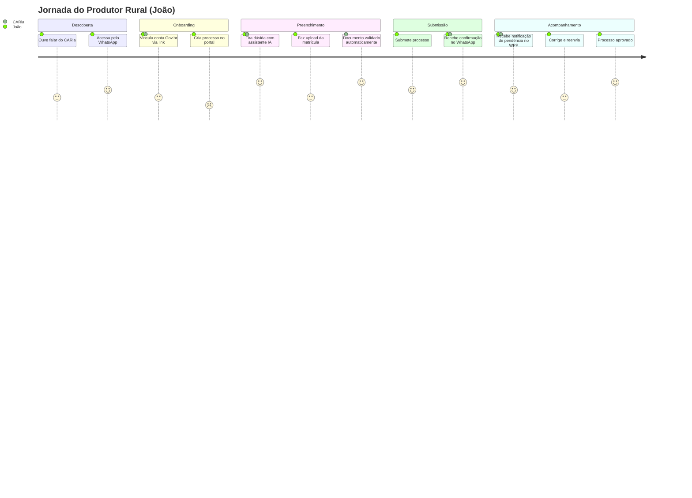

# Personas — Perspectiva UX

:::info Para quem é esta página
Designers e pesquisadores de UX. Para a visão de produto (objetivos de negócio e métricas), veja [Personas de Produto](../produto/personas.md).
:::

Esta página foca no **contexto de uso real** — onde, como e com que dispositivo cada persona acessa o CARla.

---

## João Silva — Produtor Rural

**Contexto de uso:** Zona rural, internet 3G instável, smartphone Android 8, tela 5,5"

### Jobs-to-be-done
1. "Quero saber o que preciso trazer antes de começar, para não perder viagem"
2. "Quero entender o que está errado sem precisar ligar para ninguém"
3. "Quero saber se meu processo avançou sem precisar entrar em portal"

### Padrões de Interação
- Prefere mensagens curtas, no estilo WhatsApp
- Não lê textos longos — usa scroll rápido
- Confia em tutoriais com foto/vídeo mais que em texto

### Necessidades de Design
| Necessidade | Decisão de design |
|---|---|
| Letramento digital baixo | Labels visíveis (sem só ícones), linguagem simples |
| Conectividade instável | Cache de rascunho local, upload com retry automático |
| Tela pequena | Stepper vertical, botões fullwidth, sem modais complexos |
| Notificação no canal certo | WhatsApp como canal prioritário |

---

## Ana Costa — Responsável Técnica (RT)

**Contexto de uso:** Escritório ou campo, notebook ou tablet, acesso pontual por processo autorizado

### Jobs-to-be-done
1. "Quero pré-validar os documentos do processo antes de assinar e submeter"
2. "Quero ser notificada automaticamente de pendências nos processos que assino"
3. "Quero verificar a geometria do imóvel antes de co-assinar"

### Padrões de Interação
- Acessa o CARla somente para os processos em que foi autorizada pelo produtor
- Foco em conferência técnica antes da assinatura digital
- Valoriza rastreabilidade do que foi alterado e por quem

### Necessidades de Design
| Necessidade | Decisão de design |
|---|---|
| Acesso restrito ao escopo autorizado | Exibe só processos com autorização do proprietário |
| Confirmação antes de assinar | Modal de revisão com checklist antes da submissão como RT |
| Notificação proativa de pendências | E-mail imediato + WhatsApp nos processos que assina |

---

## Carlos Mendes — Analista Ambiental

**Contexto de uso:** Servidor público, PC desktop Windows, conexão cabeada, monitor 1366×768

### Jobs-to-be-done
1. "Quero saber antes de abrir o processo se ele está completo ou não"
2. "Quero ter o dossiê pronto quando abrirmo processo"
3. "Quero registrar pendência de forma rápida, sem campo de texto longo"

### Padrões de Interação
- Analisa 10–15 processos por dia em sessões de 2–4h
- Copia e cola trechos para e-mails internos
- Prefere tabelas densas e filtros potentes a dashboards visuais

### Necessidades de Design
| Necessidade | Decisão de design |
|---|---|
| Triagem antes de abrir | Score de completude e risco visível na listagem |
| Dossiê rápido | Geração automática ao assumir processo |
| Registro de pendência | Modal com templates de motivo pré-definidos |
| Múltiplos processos abertos | Abas ou navegação sem perder contexto |

---

## Mapa de Touchpoints

