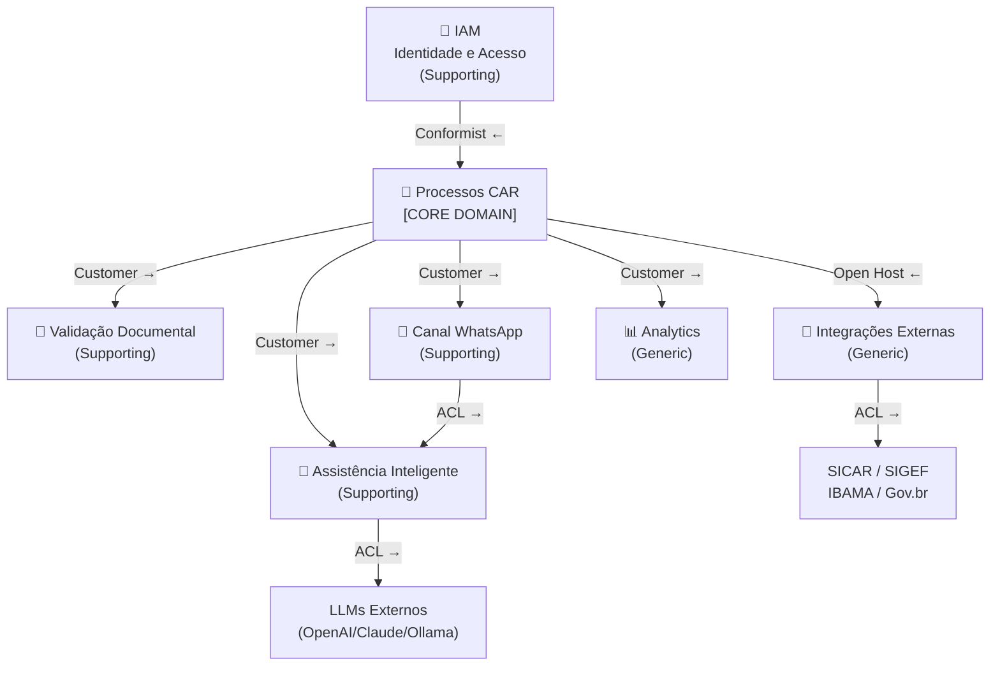

# Bounded Contexts

:::info Para quem é esta página
Engenheiros e arquitetos. Para entender o porquê das decisões, veja os [ADRs](../arquitetura/decisoes/index.md).
:::

## Mapa de Contextos



---

## Os 6 Bounded Contexts

### 🔐 IAM — Identidade e Acesso

**Tipo:** Supporting Domain  
**Responsabilidade:** Autenticação via Gov.br, JWT, RBAC (6 roles), gestão de sessões e vinculação de canais externos (WhatsApp)

**Entidades principais:** `Usuário`, `Sessão`, `CanalVinculo`  
**Sistemas externos:** Gov.br (OIDC)

:::note Relação com Processos
IAM é **Conformist** de Gov.br — segue o modelo de identidade do governo sem questionar. Processos CAR é **Customer** do IAM — consome o usuário autenticado.
:::

---

### 🌿 Processos CAR — **Core Domain**

**Tipo:** Core Domain (o coração do negócio)  
**Responsabilidade:** Ciclo de vida completo do processo CAR, máquina de estados, pendências, histórico imutável

**Agregados principais:** `ProcessoCAR`, `ImóvelRural`  
**Eventos de domínio:** `ProcessoIniciado`, `ProcessoSubmetido`, `PendênciaIdentificada`, `ProcessoAprovado`, `ProcessoAprovadoComPRA`, `ProcessoRejeitado`

:::tip Por que é o Core Domain?
O processo CAR é o centro do negócio — é o que o CARla existe para facilitar. Toda a complexidade de negócio reside aqui. Os outros BCs são suporte.
:::

---

### 📄 Validação Documental

**Tipo:** Supporting Domain  
**Responsabilidade:** OCR, extração de dados estruturados, validação de consistência, cruzamento entre documentos

**Agregados:** `Documento`, `LoteValidação`  
**Regra-chave:** Tolerância de 5% na comparação de áreas entre documentos

---

### 💬 Canal WhatsApp

**Tipo:** Supporting Domain  
**Responsabilidade:** Recepção de mensagens (texto e áudio) via **Meta Cloud API (WhatsApp Business Platform oficial)**, transcrição de áudio com Whisper local, fluxo de vinculação Gov.br, roteamento para Assistência Inteligente

**Entidades:** `SessãoWhatsApp`, `VinculaçãoCanal`  
**Armazenamento de sessão:** Redis (TTL 30 dias)  
**Número:** armazenado apenas como hash SHA-256 (LGPD)

**Pipeline de mensagem de voz:**
```
Cidadão envia áudio (.ogg/Opus)
   → WhatsApp Worker baixa o arquivo via Meta Cloud API
   → Transcrição com Whisper local via container dedicado (faster-whisper ou whisper.cpp)
   → Texto transcrito roteado para Assistência Inteligente
   → Resposta em texto retorna ao cidadão com prefixo "🎙️ Ouvi você dizer: ..."
```

:::tip Por que Whisper local?
Áudio de voz contém dados biométricos — enviar para serviços externos de STT na nuvem levanta questões LGPD. O Whisper (OpenAI, open-source) roda on-premises via **container dedicado** (`faster-whisper` ou `whisper.cpp`) — **não via Ollama**, que é um runtime exclusivo para LLMs de texto e não suporta modelos de Speech-to-Text. O áudio nunca sai da infraestrutura. Ver requisitos de hardware em [Estratégia de IA](../arquitetura/ia.md#stt--transcrição-de-voz).
:::

:::warning Provider WhatsApp — use somente a API oficial
Z-API, UltraMsg e similares são plataformas **não oficiais** que violam os Termos de Serviço do Meta. Para um sistema governamental, o uso de APIs não oficiais gera risco jurídico (ToS), operacional (banimento da conta sem aviso) e de imagem. Use exclusivamente a **Meta Cloud API (WhatsApp Business Platform)** — requer aprovação do Meta, número verificado e tem custo por conversa (~U$ 0,02–0,06 na América Latina). Ver [ADR-007](../arquitetura/decisoes/adr-007-whatsapp.md).
:::

---

### 🤖 Assistência Inteligente

**Tipo:** Supporting Domain  
**Responsabilidade:** Chat com LLM, RAG com normativos CAR, classificação de intenção, geração de dossiês

**Anti-Corruption Layer:** `LLMProvider` abstrato — isola o domínio dos providers externos (OpenAI, Claude, Ollama)

---

### 🔌 Integrações Externas

**Tipo:** Generic Subdomain  
**Responsabilidade:** Anti-Corruption Layer para todos os sistemas externos (SICAR, SIGEF, IBAMA, MapBiomas)

**Padrões:** Circuit Breaker, retry com backoff exponencial, cache Redis

---

### 📊 Analytics e Reporting

**Tipo:** Generic Subdomain  
**Responsabilidade:** Dossiês PDF, relatórios gerenciais, métricas, dashboards

---

## Regras de Comunicação entre Contextos

:::warning Nunca cruzar fronteiras de agregados diretamente
Contextos se comunicam via **eventos de domínio** (RabbitMQ) ou **Anti-Corruption Layer**. Nunca via chamada direta ao repositório de outro BC.
:::

| Comunicação | Mecanismo |
|---|---|
| Processos → Validação | Evento `DocumentoAnexado` → Worker de Validação |
| Processos → Assistente | HTTP (quando usuário inicia chat com contexto do processo) |
| Processos → WhatsApp | Evento `PendênciaIdentificada` → Worker de Notificação |
| Processos → Integrações | Evento `ProcessoSubmetido` → Worker de Integração |
| WhatsApp → Assistente | HTTP interno (roteamento de mensagem) |

## Ver também

- [Event Storming](./event-storming.md) — eventos e comandos por BC
- [Arquitetura — Containers](../arquitetura/servicos.md) — implementação de cada BC como serviço
- [ADR-003 — EDA](../arquitetura/decisoes/adr-003-eda.md) — por que eventos em vez de chamadas síncronas
