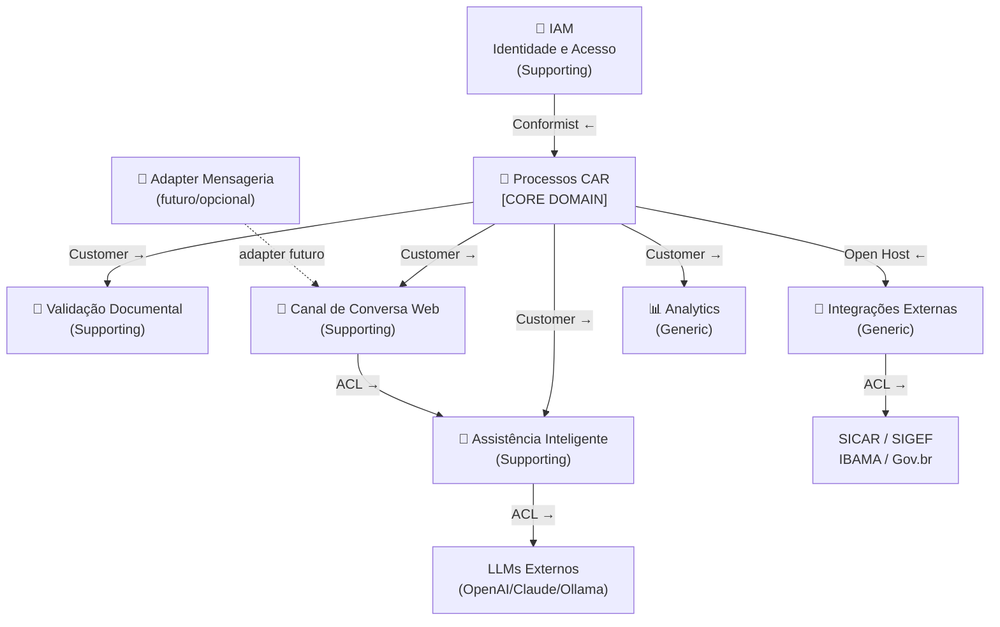

# Bounded Contexts

:::info Para quem é esta página
Engenheiros e arquitetos. Para entender o porquê das decisões, veja os [ADRs](../arquitetura/decisoes/index.md).
:::

## Mapa de Contextos

---

## Os 6 Bounded Contexts

### 🔐 IAM — Identidade e Acesso

**Tipo:** Supporting Domain  
**Responsabilidade:** Autenticação via Gov.br, JWT, RBAC (6 roles), gestão de sessões web persistentes vinculadas ao `user_id` do Gov.br

**Entidades principais:** `Usuário`, `SessãoWeb`, `CanalVinculo` (futuro: para adapter de mensageria)  
**Sistemas externos:** Gov.br (OIDC)

:::note Relação com Processos
IAM é **Conformist** de Gov.br — segue o modelo de identidade do governo sem questionar. Processos CAR é **Customer** do IAM — consome o usuário autenticado.
:::

---

### 🌿 Processos CAR — **Core Domain**

**Tipo:** Core Domain (o coração do negócio)  
**Responsabilidade:** Ciclo de vida completo do processo CAR, máquina de estados, pendências, histórico imutável

**Agregados principais:** `ProcessoCAR`, `ImóvelRural`  
**Eventos de domínio:** `ProcessoIniciado`, `ProcessoSubmetido`, `PendênciaIdentificada`, `ProcessoRegular`, `ProcessoPendenteDeRegularização`

:::tip Por que é o Core Domain?
O processo CAR é o centro do negócio — é o que a Carla existe para facilitar. Toda a complexidade de negócio reside aqui. Os outros BCs são suporte.
:::

---

### 📄 Validação Documental

**Tipo:** Supporting Domain  
**Responsabilidade:** OCR, extração de dados estruturados, validação de consistência, cruzamento entre documentos

**Agregados:** `Documento`, `LoteValidação`  
**Regra-chave:** Tolerância de 5% na comparação de áreas entre documentos

---

### 💬 Canal de Conversa Web

**Tipo:** Supporting Domain  
**Responsabilidade:** Recepção e envio de mensagens da interface de chat web da Carla, gestão de sessão de conversa por `user_id`, roteamento de mensagens para Assistência Inteligente, notificações in-app (mensagens do analista, status do CAR)

**Entidades:** `SessãoConversa`, `MensagemConversa`  
**Armazenamento de sessão:** Redis + PostgreSQL (histórico persistente)  
**Canal principal:** Interface web própria (sem dependência de terceiros)

:::note Adapter de Mensageria (futuro/opcional)
Apps de mensageria (WhatsApp, Telegram etc.) poderão ser integrados futuramente como um **adapter externo desacoplado** — um serviço separado que traduz mensagens para o protocolo deste BC e repassa. O BC "Canal de Conversa Web" não depende do adapter para funcionar. Ver [ADR-008](../arquitetura/decisoes/adr-008-canal-web-proprio.md).
:::

---

### 🤖 Assistência Inteligente

**Tipo:** Supporting Domain  
**Responsabilidade:** Chat com LLM, RAG com normativos CAR, classificação de intenção, geração de dossiês

**Anti-Corruption Layer:** `LLMProvider` abstrato — isola o domínio dos providers externos (OpenAI, Claude, Ollama)

---

### 🔌 Integrações Externas

**Tipo:** Generic Subdomain  
**Responsabilidade:** Anti-Corruption Layer para todos os sistemas externos (SICAR, SIGEF, IBAMA, MapBiomas)

**Padrões:** Circuit Breaker, retry com backoff exponencial, cache Redis

---

### 📊 Analytics e Reporting

**Tipo:** Generic Subdomain  
**Responsabilidade:** Dossiês PDF, relatórios gerenciais, métricas, dashboards

---

## Regras de Comunicação entre Contextos

:::warning Nunca cruzar fronteiras de agregados diretamente
Contextos se comunicam via **eventos de domínio** (RabbitMQ) ou **Anti-Corruption Layer**. Nunca via chamada direta ao repositório de outro BC.
:::

| Comunicação | Mecanismo |
|---|---|
| Processos → Validação | Evento `DocumentoAnexado` → Worker de Validação |
| Processos → Assistente | HTTP (quando usuário inicia chat com contexto do processo) |
| Processos → Canal de Conversa | Evento `PendênciaIdentificada` → Worker de Notificação |
| Processos → Integrações | Evento `ProcessoSubmetido` → Worker de Integração |
| Canal de Conversa → Assistente | HTTP interno (roteamento de mensagem) |
| Adapter Mensageria → Canal de Conversa | HTTP (traduz e repassa mensagem externa) |

## Ver também

- [Event Storming](./event-storming.md) — eventos e comandos por BC
- [Arquitetura — Containers](../arquitetura/servicos.md) — implementação de cada BC como serviço
- [ADR-003 — EDA](../arquitetura/decisoes/adr-003-eda.md) — por que eventos em vez de chamadas síncronas
- [ADR-008 — Canal Web Próprio](../arquitetura/decisoes/adr-008-canal-web-proprio.md) — decisão de canal
