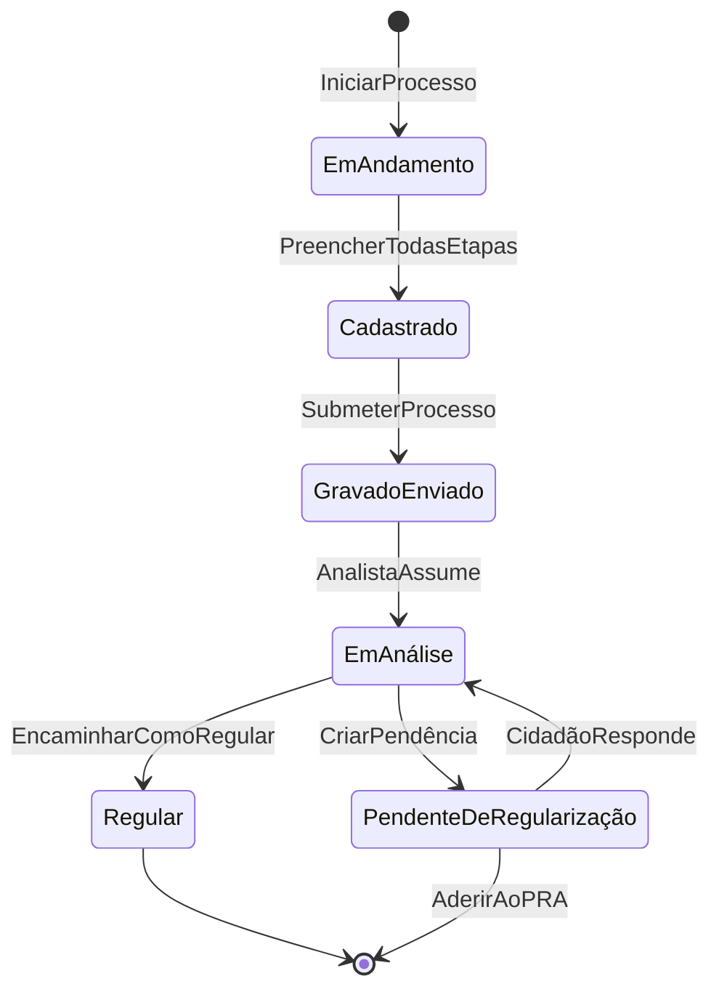

# Event Storming

:::info Para quem é esta página
Engenheiros e PMs técnicos. Contexto de produto: [Casos de Uso](../produto/casos-de-uso.md).
:::

## Legenda

| Elemento | Notação | Descrição |
|---|---|---|
| **Evento de Domínio** | `[EVENTO]` | Algo que aconteceu — passado, irreversível |
| **Comando** | `→ Comando` | Ação que dispara um evento |
| **Política** | `⇒ Política:` | "Quando X ocorre, faça Y" |
| **Ator** | **Ator** | Quem executa o comando |
| **Read Model** | 📊 | Dado de leitura atualizado pelo evento |

---

## BC: Gestão de Processos CAR

### Ciclo de Vida do Processo

| Evento | Dispara por | Políticas |
|---|---|---|
| `ProcessoIniciado` | Cidadão → IniciarProcesso | CriarImóvelAssociado, IniciarAssistente |
| `GeometriaDefinida` | Cidadão → DefinirGeometria | ValidarGeometriaAssíncrono |
| `ProcessoSubmetido` | Cidadão → SubmeterProcesso | GerarRecibodeInscrição, NotificarAnalistaDisponível |
| `ProcessoEmAnálise` | Analista → AssumirProcesso | GerarDossiêAutomático |
| `PendênciaIdentificada` | Analista → CriarPendência | NotificarCidadão (email + Canal Web) |
| `ProcessoRegular` | Analista → EncaminharComoRegular | DisponibilizarRecibodeInscrição, NotificarCidadão |
| `ProcessoPendenteDeRegularização` | Analista → EncaminharComPendência | NotificarCidadãoSobrePendência, LiberarAbaRegularizaçãoAmbiental |

### Máquina de Estados (Terminologia oficial SICAR)

---

## BC: Canal de Conversa Web

| Evento | Dispara por | Políticas |
|---|---|---|
| `MensagemWebRecebida{canal: web}` | Cidadão → EnviarMensagem | ClassificarIntenção, RoteadoParaAssistenteIA |
| `SessãoIniciada` | Cidadão → AbrirCarla | VerificarContextoAtivo (mensagens não lidas, etapa do CAR) |
| `SessãoRetomada` | Cidadão → RetornarÀCarla | ExibirResumoEtapa, ExibirMensagensNãoLidas |
| `MensagemAnalistaDelivered` | Sistema → NotificarCidadão | MarcarComoNãoLida, PriorizarNaReta |
| `ConversaçãoRoteada` | Sistema → ClassificarMensagem | RoteadoParaAssistenteIA ou RedirecionadoParaEtapaCAR |

:::note Adapter de Mensageria (futuro/opcional)
Quando o adapter de mensageria for implementado, ele gerará o mesmo evento `MensagemRecebida{canal: whatsapp | telegram}` — o BC de Canal de Conversa os processa da mesma forma, apenas com metadados de canal diferentes. O domínio é agnóstico ao canal de origem.
:::

---

## BC: Validação Documental

| Evento | Dispara por | Políticas |
|---|---|---|
| `DocumentoRecebido` | Cidadão → FazerUpload | ArmazenarMinIO, PublicarNaFilaOCR |
| `OCRConcluído` | Worker → ProcessarOCR | ExtrairDadosEstruturados |
| `DocumentoValidado` | Worker → ValidarDocumento | AtualizarScoreCompletude |
| `InconsistênciaDetectada` | Worker → DetectarDivergência | CriarPendênciaAutomática |

---

## Tabela Consolidada de Eventos

| Evento | BC | Routing Key RabbitMQ |
|---|---|---|
| `ProcessoIniciado` | Processos | `processo.iniciado.v1` |
| `ProcessoSubmetido` | Processos | `processo.submetido.v1` |
| `PendênciaIdentificada` | Processos | `processo.pendencia_identificada.v1` |
| `ProcessoRegular` | Processos | `processo.regular.v1` |
| `ProcessoPendenteDeRegularização` | Processos | `processo.pendente_regularizacao.v1` |
| `DocumentoRecebido` | Validação | `documento.recebido.v1` |
| `DocumentoValidado` | Validação | `documento.validado.v1` |
| `MensagemWebRecebida` | Canal Web | `canal.web.mensagem.v1` |
| `SessãoIniciada` | Canal Web | `canal.web.sessao_iniciada.v1` |
| `MensagemAnalistaDelivered` | Canal Web | `canal.web.notificacao_analista.v1` |

> **Adapter futuro (routing keys reservadas):**  
> `canal.mensageria.mensagem.v1` — mensagem recebida de app de mensageria externo  
> `canal.mensageria.vinculado.v1` — número vinculado ao user_id Gov.br

:::tip Versioning de eventos
Todos os routing keys terminam em `.v1`. Quando o payload mudar de forma incompatível, crie `.v2` e mantenha ambos ativos por 1 ciclo de deploy.
:::

## Ver também

- [Mensageria — RabbitMQ](../arquitetura/mensageria.md) — configuração de exchanges e filas
- [ADR-003 — EDA](../arquitetura/decisoes/adr-003-eda.md) — por que Event-Driven Architecture
