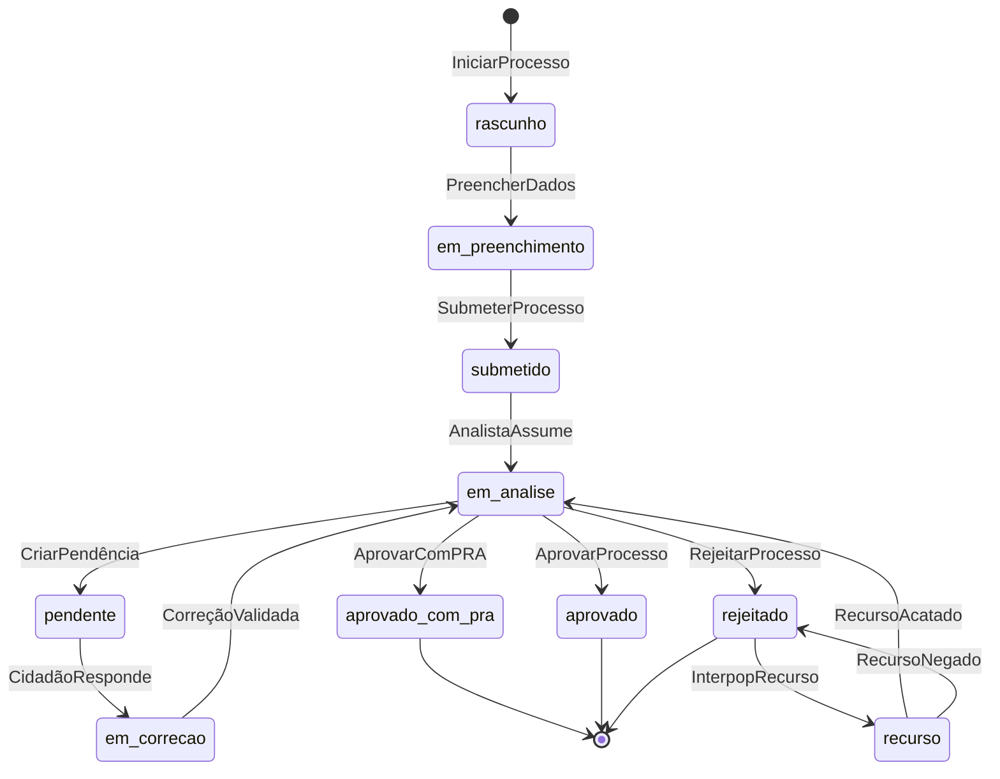

# Event Storming

:::info Para quem é esta página
Engenheiros e PMs técnicos. Contexto de produto: [Casos de Uso](../produto/casos-de-uso.md).
:::

## Legenda

| Elemento | Notação | Descrição |
|---|---|---|
| **Evento de Domínio** | `[EVENTO]` | Algo que aconteceu — passado, irreversível |
| **Comando** | `→ Comando` | Ação que dispara um evento |
| **Política** | `⇒ Política:` | "Quando X ocorre, faça Y" |
| **Ator** | **Ator** | Quem executa o comando |
| **Read Model** | 📊 | Dado de leitura atualizado pelo evento |

---

## BC: Gestão de Processos CAR

### Ciclo de Vida do Processo

| Evento | Dispara por | Políticas |
|---|---|---|
| `ProcessoIniciado` | Cidadão → IniciarProcesso | CriarImóvelAssociado, IniciarAssistenteBV |
| `GeometriaDefinida` | Cidadão → DefinirGeometria | ValidarGeometriaAssíncrono |
| `ProcessoSubmetido` | Cidadão → SubmeterProcesso | GerarNúmeroProtocoloSICAR, NotificarAnalistaDisponível |
| `ProcessoEmAnálise` | Analista → AssumirProcesso | GerarDossiêAutomático |
| `PendênciaIdentificada` | Analista → CriarPendência | NotificarCidadão (email + WhatsApp) |
| `ProcessoAprovado` | Analista → AprovarProcesso | EmitirCertificadoCAR, NotificarCidadão |
| `ProcessoAprovadoComPRA` | Analista → AprovarComPRA | EmitirCertificadoCAR, NotificarCidadãoSobrePRAObrigatório, AgendarLembretePrazoAdesãoPRA |
| `ProcessoRejeitado` | Analista → RejeitarProcesso | NotificarCidadão, IniciarPrazoRecurso |
| `RecursoInterposto` | Cidadão → InterpорRecurso | EscalonarParaSupervisor |

### Máquina de Estados

---

## BC: Canal WhatsApp

| Evento | Dispara por | Políticas |
|---|---|---|
| `MensagemWhatsAppRecebida` | Cidadão → EnviarMensagem (texto) | VerificarVinculação |
| `ÁudioWhatsAppRecebido` | Cidadão → EnviarÁudio | TranscreverComWhisper, VerificarVinculação |
| `ÁudioTranscrito` | Worker → TranscreverÁudio | RoteadoComoMensagemTexto |
| `SessãoNãoAutenticada` | Sistema → ChecarSessão | GerarTokenVinculação, EnviarLinkVinculação |
| `NúmeroWhatsAppVinculado` | Gov.br → RetornarCallback | NotificarBotDaVinculação, ContinuarAtendimento |
| `ConversaçãoRoteada` | Sistema → ClassificarMensagem | RoteadoParaAssistenteIA ou RedirecionadoAoPortal |

---

## BC: Validação Documental

| Evento | Dispara por | Políticas |
|---|---|---|
| `DocumentoRecebido` | Cidadão → FazerUpload | ArmazenarMinIO, PublicarNaFilaOCR |
| `OCRConcluído` | Worker → ProcessarOCR | ExtrairDadosEstruturados |
| `DocumentoValidado` | Worker → ValidarDocumento | AtualizarScoreCompletude |
| `InconsistênciaDetectada` | Worker → DetectarDivergência | CriarPendênciaAutomática |

---

## Tabela Consolidada de Eventos

| Evento | BC | Routing Key RabbitMQ |
|---|---|---|
| `ProcessoIniciado` | Processos | `processo.iniciado.v1` |
| `ProcessoSubmetido` | Processos | `processo.submetido.v1` |
| `PendênciaIdentificada` | Processos | `processo.pendencia_identificada.v1` |
| `ProcessoAprovado` | Processos | `processo.aprovado.v1` |
| `ProcessoAprovadoComPRA` | Processos | `processo.aprovado_com_pra.v1` |
| `ProcessoRejeitado` | Processos | `processo.rejeitado.v1` |
| `DocumentoRecebido` | Validação | `documento.recebido.v1` |
| `DocumentoValidado` | Validação | `documento.validado.v1` |
| `NúmeroWhatsAppVinculado` | WhatsApp | `canal.whatsapp.vinculado.v1` |
| `MensagemWhatsAppRecebida` | WhatsApp | `canal.whatsapp.mensagem.v1` |
| `ÁudioWhatsAppRecebido` | WhatsApp | `canal.whatsapp.audio.v1` |
| `ÁudioTranscrito` | WhatsApp | `canal.whatsapp.audio_transcrito.v1` |

:::tip Versioning de eventos
Todos os routing keys terminam em `.v1`. Quando o payload mudar de forma incompatível, crie `.v2` e mantenha ambos ativos por 1 ciclo de deploy.
:::

## Ver também

- [Mensageria — RabbitMQ](../arquitetura/mensageria.md) — configuração de exchanges e filas
- [ADR-003 — EDA](../arquitetura/decisoes/adr-003-eda.md) — por que Event-Driven Architecture
