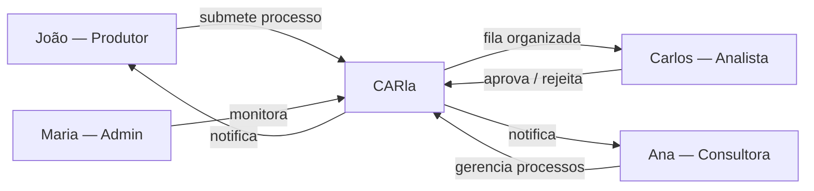

# Personas

:::info Para quem é esta página
Times de produto, design e pesquisa de UX. Para a versão focada em jornadas e fluxos de tela, veja [Personas UX](../design/personas.md).
:::

## P1 — João Silva | Produtor Rural

**52 anos · Agricultor familiar · Interior do Maranhão · Propriedade de 50 ha**

João herdou a terra do pai. Usa smartphone Android básico, tem dificuldade com interfaces digitais e já tentou fazer o CAR duas vezes — desistiu nas duas.

| Dimensão | Detalhe |
|---|---|
| **Objetivo principal** | Regularizar a propriedade para acessar crédito rural (exigência do banco) |
| **Letramento digital** | Baixo — usa WhatsApp, pouco além |
| **Canais preferidos** | WhatsApp, telefone, atendimento presencial |
| **Maior frustração** | "Não entendo o que estão pedindo e não tenho com quem tirar dúvida" |

:::tip Job-to-be-done
João quer regularizar o imóvel **sem contratar consultor** — ele precisa de orientação em linguagem simples, não de formulário técnico.
:::

**Critérios de satisfação:**
- Conseguir iniciar e completar o processo sem ajuda presencial
- Receber notificação de pendência explicando o que falta em linguagem clara
- Acompanhar o status do WhatsApp, sem precisar entrar em portal

---

## P2 — Ana Costa | Consultora Ambiental

**35 anos · Engenheira florestal · Brasília-DF · Carteira de 200+ clientes**

Ana gerencia processos CAR de médios e grandes proprietários rurais. Tem ótimo domínio tecnológico e precisa de eficiência — tempo é dinheiro para ela.

| Dimensão | Detalhe |
|---|---|
| **Objetivo principal** | Submeter processos corretos de primeira — evitar idas e vindas |
| **Letramento digital** | Alto — usa planilhas, sistemas GIS, APIs |
| **Maior frustração** | "Não tenho visão consolidada dos meus clientes; descubro a pendência só quando o cliente liga" |

:::tip Job-to-be-done
Ana quer **pré-validar documentos antes de submeter** e receber alertas automáticos de pendência sem precisar checar o SICAR um por um.
:::

---

## P3 — Carlos Mendes | Analista Ambiental

**40 anos · Técnico ambiental · Servidor SEMA-MT · 300+ processos na fila**

Carlos trabalha com sistema legado lento e acumula horas extras para dar conta do volume. Abre processos e frequentemente descobre que falta documento básico — retrabalho evitável.

| Dimensão | Detalhe |
|---|---|
| **Objetivo principal** | Analisar mais processos por dia sem aumentar carga de trabalho |
| **Maior frustração** | "Gasto horas conferindo documentos que deveriam ter sido validados antes de chegar pra mim" |
| **O que mais valoriza** | Triagem inteligente e dossiê já pronto ao abrir um processo |

:::tip Job-to-be-done
Carlos quer **focar no julgamento técnico**, não na conferência manual de documentos.
:::

---

## P4 — Maria Santos | Administradora do Sistema

**38 anos · Analista de TI · SEMAD estadual · Responsável pela plataforma**

Maria mantém o sistema no ar, gerencia usuários e resolve incidentes. Não quer ser surpreendida — quer visibilidade antecipada de problemas.

| Dimensão | Detalhe |
|---|---|
| **Objetivo principal** | Uptime ≥ 99,5%, zero surpresas em produção |
| **Maior frustração** | "Fico sabendo do erro pelo usuário, não pelo sistema" |
| **O que mais valoriza** | Dashboard operacional em tempo real e configurações sem deploy |

---

## Relação entre Personas

## Ver também

- [Casos de Uso](./casos-de-uso.md) — o que cada persona consegue fazer
- [Fluxo do Cidadão](../design/fluxos/cidadao.md) — jornada do João e da Ana
- [Fluxo do Analista](../design/fluxos/analista.md) — jornada do Carlos
